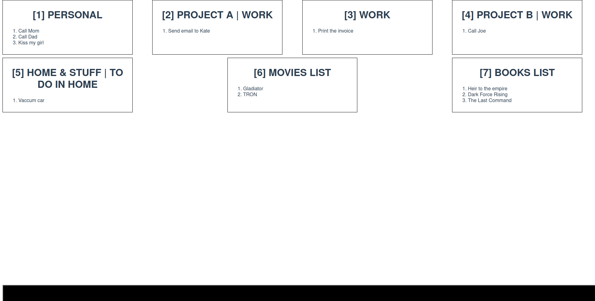

# habbitica-vue-min

## About
Simple hacky way to Habbitica display TODOs grouped by TAGS and quickly mark them done by writing simple "vim-like" commands.

Made so I don't have to interact with Habbitica filter window while trying to get my work done.

## Usage

Command belows allow you to quickly add / mark as done / delete yours TODOs.

```CTRL + SHIFT + B``` moves focus to bar

```a:board_number:task_title``` - Adds TASK, so   
```a:5:Call Mark``` - will add task to board number 5  

```v:board_number:task_number``` - completes task, so  
```v:5:1``` will complete task number 1 on board number 5

```d:board_number:task_number``` - deletes task   
```d:5:1``` deletes task number 1 on board number 5

## ENV
You'll need to set  
VUE_APP_API_KEY and VUE_APP_USER_UID
both can be generated on Habbitica dashboard.

## Project setup
You'll propably want to setup it on localhost. If you need access from multiple devices, consider basic-auth as simple way to protect yours instance. 
```
npm install
```

### Compiles and hot-reloads for development
```
npm run serve
```

### Compiles and minifies for production
```
npm run build
```

### Run your unit tests
```
npm run test:unit
```

### Lints and fixes files
```
npm run lint
```

### Customize configuration
See [Configuration Reference](https://cli.vuejs.org/config/).
